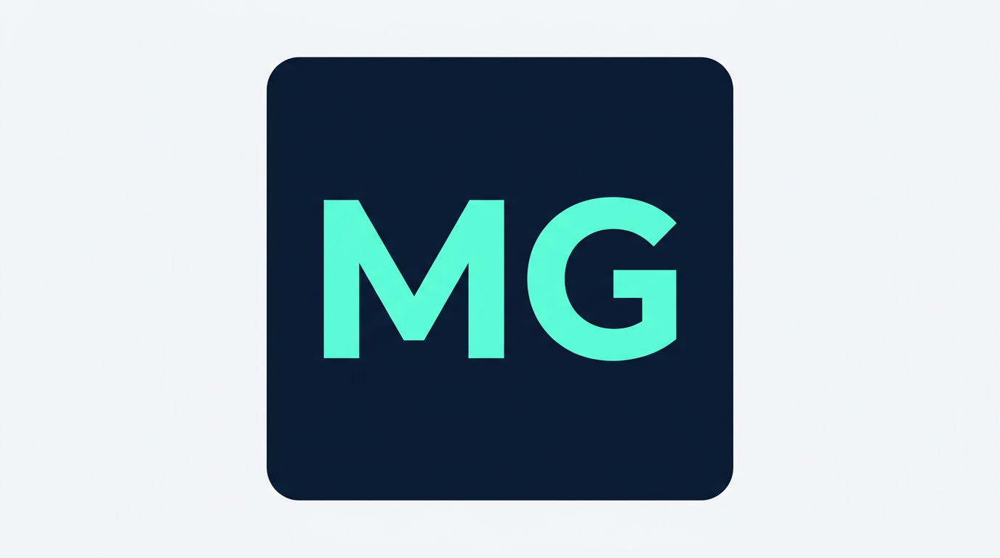

  

<h1 align="center">
  Moise Gasana
</h1>

  Full-stack engineer — CS senior at <a href="https://www.brown.edu/">Brown University</a> · building AI products
  that solve real problems for real people.

  My personal website adapted from the fourth iteration of <a href="https://brittanychiang.com" target="_blank">brittanychiang.com</a> built with <a href="https://www.gatsbyjs.com/" target="_blank">Gatsby</a> and <a href="https://www.gatsbyjs.com/docs/reference/gatsby-cli/" target="_blank">Gatsby CLI</a> for static output.

Special thanks to <a href="https://brittanychiang.com" target="_blank">Brittany Chiang</a> for the <a href="https://brittanychiang.com" target="_blank">original v4</a> template that inspired this project.
